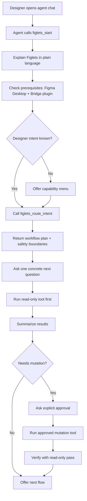
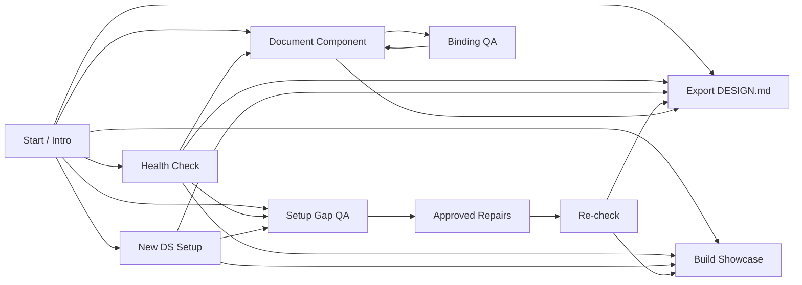
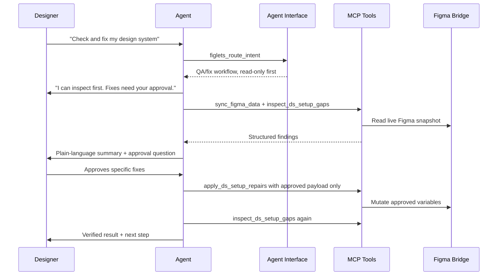

# Agent Interface product plan

**Purpose.** This document defines the "Agent Interface" feature for Figlets-MCP: a durable, agent-agnostic product layer that helps any MCP-speaking agent introduce Figlets, route designer intent, run the right workflow, ask for the right confirmations, recover from errors, and continue naturally into the next step.

**Audience.** Future agents and maintainers implementing the feature. Read this before editing adapter docs, adding slash commands, or changing MCP tool descriptions.

**Status.** Product plan approved in principle. **No implementation started.** Start with the read-only workflow registry and MCP guide tools described below.

---

## 1. Product definition

Figlets-MCP should feel like this to a designer:

> "I tell the agent what I want in normal language. It tells me what Figlets can do, checks my Figma file, explains results plainly, asks before changing anything, runs the reliable tools, verifies the outcome, and suggests the next useful step."

The Agent Interface is the layer that makes this consistent across Claude, Codex, Cursor, and future MCP hosts.

It is similar in spirit to Claude Code skills, but it must not be Claude-only. The source of truth should live in Figlets itself and be exposed through MCP.

---

## 2. Why this feature exists

Figlets already has the lower-level pieces:

- deterministic MCP tools for sync, setup, QA, repair, showcase, docs, and export
- adapter docs in `packages/figlets-adapter/AGENTS.md` and `packages/figlets-adapter/CLAUDE.md`
- paste-ready designer prompts in `docs/prompts/setup-gap-repair.md` and `docs/prompts/export-design-md.md`
- MCP tool descriptions that include some safety boundaries

The problem is that the interface is scattered. A capable agent can piece it together, but a random MCP-speaking agent may not know:

- what to say first
- which workflow to choose
- which tools are read-only
- which tools require designer approval
- how to summarize results without dumping JSON
- what to do after a workflow finishes
- how to recover when Figma, the bridge, config, or selection state is wrong

The Agent Interface turns those scattered rules into a single product surface.

---

## 3. Product contract

The Agent Interface must preserve the existing Figlets philosophy:

1. **Designer language first.** The designer should not need to know MCP tool names.
2. **Read-only before mutation.** Inspect, summarize, and ask before applying changes.
3. **Explicit approval for Figma writes.** No tool that mutates Figma should run because a workflow guide said a finding is high confidence.
4. **Deterministic logic stays in code.** The agent must not do contrast math, token matching, naming inference, alias selection, or Figma mutation by intuition.
5. **The agent interprets ambiguity.** The interface should tell the agent where judgment is required and what to ask the designer.
6. **Continuation is part of the product.** Every workflow should end with safe next steps.
7. **Agent-agnostic first.** Claude/Codex adapter docs and slash commands are views over the interface, not the source of truth.
8. **Machine-portable paths.** Designer prompts and workflow guides must not hardcode one developer's machine path. The interface should discover or return paths at runtime.

---

## 4. Path and environment portability

The Agent Interface must be self-aware about where Figlets is installed and where active-file artifacts live.

Repo docs and examples must use relative paths or generic placeholders (e.g. `<repo-root>`), never developer-local absolute paths that embed a username. Such paths are not acceptable in product-facing prompts or generated workflow guidance.

### Rules

1. **Do not require a project location in designer prompts.** If the MCP server is connected, the agent already has the tools. If a local path is needed, the tool should return it.
2. **Prefer the global command `figlets-mcp`.** Agent MCP configs should call `figlets-mcp` rather than `node /absolute/path/to/.../index.js`.
3. **Use runtime paths returned by tools.** For example, `export_design_md` should return the final `DESIGN.md` path; the agent should report that value instead of constructing one.
4. **Use file-scoped active paths.** The active Figma file should resolve to `.local/<fileKey>/...` through the server's path utilities, not through user-authored path guesses.
5. **Keep `FIGLETS_LOCAL_DIR` as the advanced override.** Teams that need a custom data directory can set it, but designers should not need to know it exists.
6. **Never ask designers for config paths by default.** The default should be the active file config path. Ask only when there are multiple plausible configs or the user explicitly wants a custom location.
7. **Docs may show placeholders, not personal paths.** Use `<repo>`, `<fileKey>`, `<project>`, or "the path returned by the tool" in public docs.

### Product implication

`figlets_start` should include an optional `environment` object:

```js
{
  command: "figlets-mcp",
  localDir: ".local or FIGLETS_LOCAL_DIR",
  activeFileKnown: true,
  activeFileKey: "local_...",
  configPath: "/runtime/path/from/server/design-system.config.js"
}
```

If this data is not available yet, the guide should say "I'll sync first so Figlets can identify the active file" rather than asking the designer to locate files manually.

---

## 5. Installation strategy

Installation is likely the biggest adoption risk for less technical designers. The Agent Interface helps after MCP is connected; installation work must make the connection itself easy.

### Desired designer experience

The ideal first install looks like:

1. Install the Figlets Bridge plugin in Figma.
2. Run one setup command or install one agent plugin.
3. Open Figma Desktop and the bridge plugin.
4. Tell the agent: "Help me with my design system."

No manual JSON editing, no absolute Node paths, no cloning unless the user is a developer.

### Recommended distribution paths

| Path | Audience | What it solves | Risk |
|---|---|---|---|
| `npx figlets-mcp setup` | Claude Desktop, Cursor, Codex, Windsurf, Gemini, general MCP hosts | Detects agent configs, installs/links the MCP server, writes config using `figlets-mcp` command, offers plugin install instructions | Needs careful cross-platform JSON/TOML patching |
| Claude Code plugin | Claude Code users | Bundles MCP config, slash commands, and skill-like prompts in one install flow | Claude-specific, not sufficient for agent-agnostic product |
| Dev-import Figma plugin package | Early local users | Works with current localhost bridge architecture | Still too technical for many designers |
| Figma org/community publication | Enterprise/public designers | One-click Figma plugin install | Community publication requires architectural change because published plugins cannot use localhost |

### MVP install tool behavior

`npx figlets-mcp setup` should:

1. Check Node version and package availability.
2. Install or link the `figlets-mcp` command so MCP configs do not contain absolute repo paths.
3. Detect likely agent hosts:
   - Claude Desktop config
   - Claude Code CLI
   - Cursor MCP config
   - Codex config
   - Windsurf config
   - VS Code MCP config
   - Gemini settings
4. Ask permission before editing each config.
5. Patch configs idempotently.
6. Run `figlets-mcp doctor`.
7. Show a short Figma Bridge plugin install/open checklist.
8. End with the first designer prompt: "Open your agent and ask: Help me with my design system."

### Installer safety rules

- Always back up files before patching configs.
- Show exactly which config file will change.
- Never overwrite unrelated MCP servers.
- Prefer adding `"command": "figlets-mcp"` over absolute paths.
- If auto-detection fails, print a copy-paste config snippet from `docs/mcp-config-examples.md`.
- Keep platform-specific paths inside installer code, not in designer-facing workflow prompts.

### Relationship to Agent Interface

The installer and the Agent Interface should share the same language:

- installer gets the designer connected
- `figlets_start` confirms the connection and explains what is possible
- workflow guides carry the designer from one task to the next

Do not put installation logic inside `figlets_start` for MVP. If MCP is not connected, the agent cannot call it anyway. Keep install as a CLI/plugin packaging track, and keep Agent Interface as the connected-runtime track.

---

## 6. Proposed shape

Create a read-only workflow registry inside the MCP server. It should be plain data plus small helper functions, so it is easy to test and render into docs later.

Suggested module:

```text
packages/figlets-mcp-server/src/agent-interface/workflows.js
```

Expose it through read-only MCP tools:

| Tool | Purpose | Mutates Figma? |
|---|---|---|
| `figlets_start` | Returns the intro, prerequisites, capability menu, and first designer-facing question. | No |
| `figlets_route_intent` | Maps natural-language designer intent to the most likely Figlets workflow. | No |
| `figlets_workflow_guide` | Returns the step contract for one workflow: tools, confirmations, summary style, errors, next steps. | No |
| `figlets_next_step` | Given a completed workflow/result category, suggests safe next flows. Optional after MVP. | No |

These tools do not call Figma, inspect snapshots, write files, or apply fixes. They only teach the agent how to operate Figlets safely.

---

## 7. First-run experience

The designer-facing first message should be short and reassuring:

> "Hi, I'm Figlets. I can help set up, check, repair, document, and export your Figma design system. I'll inspect first, explain in plain language, and only change Figma after you approve the exact fix. What are you trying to do today?"

The agent can then route the answer through `figlets_route_intent`.



---

## 8. Workflow map

The Agent Interface should make these flows discoverable and chainable.



---

## 9. Safety flow

The interface should make the confirmation boundary impossible to miss.



---

## 10. Canonical workflows for MVP

### Start / Help

Designer intent examples:

- "What can you do?"
- "Help me with my design system."
- "I'm new to Figlets."

Guide behavior:

1. Introduce Figlets in one short paragraph.
2. Explain that inspection is read-only and fixes need approval.
3. Ask whether Figma Desktop and the Figlets Bridge plugin are open.
4. Offer a capability menu:
   - set up a design system
   - check an existing design system
   - fix setup gaps
   - build a token showcase
   - document a component
   - export `DESIGN.md`

Next workflows: all.

### Health Check

Designer intent examples:

- "Check my design system."
- "What's in this file?"
- "Is my DS healthy?"

Tools:

1. `sync_figma_data`
2. `detect_design_system`
3. `audit_tokens`

Confirmation boundary:

- No mutation. No explicit approval needed beyond confirming the bridge/plugin is open.

Next workflows:

- Setup Gap QA
- Build Showcase
- Export DESIGN.md
- Document Component

### Setup Gap QA + Approved Repair

Designer intent examples:

- "Check and fix my semantic colors."
- "Find missing color roles."
- "Fix contrast issues."

Tools:

1. `sync_figma_data`
2. `refresh_ds_config_from_figma({ dry_run: true })`
3. `inspect_ds_setup_gaps`
4. After explicit approval only: `apply_ds_setup_repairs`
5. Verify with `inspect_ds_setup_gaps`

Confirmation boundary:

- `inspect_ds_setup_gaps` is read-only.
- `apply_ds_setup_repairs` requires explicit approval for each cluster or item.
- Confidence means "ask the designer", not "apply automatically."

Next workflows:

- Build Showcase
- Export DESIGN.md
- Health Check

### New Design System Setup

Designer intent examples:

- "Set up a design system."
- "Create variables for my brand."
- "Bootstrap tokens."

Tools:

1. Optional: `create_ds_config_from_design_md`
2. `create_ds_config_from_intake` from designer answers; if it returns `needsDesignerInput`, ask those exact questions
3. `prepare_ds_config`
4. After explicit approval only: `apply_ds_setup`
5. Optional: `build_ds_showcase`
6. Optional: `export_design_md`

Confirmation boundary:

- `prepare_ds_config` is deterministic and read-only with respect to Figma.
- `create_ds_config_from_intake` may write the file-scoped local config, but it never mutates Figma and must not invent missing concrete values.
- `apply_ds_setup` creates collections in Figma and requires explicit approval.
- The agent must show contrast/readiness results before building.

Next workflows:

- Build Showcase
- Setup Gap QA
- Export DESIGN.md

### Build Token Showcase

Designer intent examples:

- "Build a showcase."
- "Show me my tokens visually."
- "Create a token page."

Tools:

1. `sync_figma_data`
2. Optional: `refresh_ds_config_from_figma({ dry_run: true })`
3. `build_ds_showcase`

Confirmation boundary:

- `build_ds_showcase` mutates Figma by creating/updating showcase frames.
- The designer should know it will write to the `00 · Tokens` page.
- Numeric fallback options require explicit opt-in.

Next workflows:

- Setup Gap QA
- Export DESIGN.md

### Component Documentation

Designer intent examples:

- "Document this component."
- "Make a spec sheet for Button."
- "Generate component docs."

Tools:

1. Ask designer to select the component in Figma.
2. `sync_figma_data`
3. If sync reports `activeFile.configRefresh.compatible: false` or skipped rows, summarize the mismatch in designer language and ask before any override or route exact additions through the relevant planning flow.
4. `inspect_component`
5. Agent writes component-specific description, usage rules, and variant descriptions.
6. `generate_component_doc`
7. Agent reports the returned markdown path; the tool writes the file.

Confirmation boundary:

- `inspect_component` is read-only.
- Sync does not mutate Figma. It may update existing local config entries silently when the refresh is compatible because that local JS file is Figlets' interpretation cache, not a designer-facing Figma write. Incompatible or skipped rows require a warning/decision before override; sync does not create new config tokens/styles.
- `generate_component_doc` writes a Figma spec sheet and component description metadata.
- The agent must not generate generic filler content without inspecting the component.

Next workflows:

- QA Binding Audit
- Export DESIGN.md
- Document another component

### QA Binding Audit

Designer intent examples:

- "Check this frame for raw values."
- "Fix binding gaps."
- "Are these layers using variables?"

Tools:

1. Ask designer to select the frame/component or confirm page-scope audit.
2. `qa_binding_audit` with fixes off.
3. After explicit approval only: `qa_binding_audit` with fixes on.

Confirmation boundary:

- Read-only audit first.
- Safe binding fixes require explicit approval.
- The agent must not invent nearest-color bindings outside the binding resolver.

Next workflows:

- Component Documentation
- Health Check

### Export DESIGN.md

Designer intent examples:

- "Export DESIGN.md."
- "Make a handoff file for developers."
- "Give this to a coding agent."

Tools:

1. `export_design_md` with `dry_run: true` when the designer wants a preview.
2. `export_design_md` for the actual export.

Confirmation boundary:

- This flow does not mutate Figma.
- It can write local config/markdown files.
- Do not bootstrap a missing config silently; point the designer to setup.

Next workflows:

- Component Documentation
- Health Check
- Hand off to coding agent

---

## 11. Workflow registry data model

Use a compact data shape that can be tested and rendered.

Example:

```js
{
  id: "setup-gap-qa",
  title: "Setup Gap QA + Approved Repair",
  summary: "Check semantic color setup and apply only approved repairs.",
  intents: [
    "check semantic colors",
    "fix contrast issues",
    "find missing color roles"
  ],
  prerequisites: [
    "Figma Desktop is open",
    "Figlets Bridge plugin is open"
  ],
  steps: [
    {
      id: "sync",
      kind: "read",
      tool: "sync_figma_data",
      designerMessage: "I'll pull a fresh read-only snapshot from Figma."
    },
    {
      id: "inspect",
      kind: "read",
      tool: "inspect_ds_setup_gaps",
      designerMessage: "I'll summarize the setup gaps in plain language."
    },
    {
      id: "approve-repairs",
      kind: "confirmation",
      designerMessage: "Which of these fixes do you want me to apply?"
    },
    {
      id: "apply-repairs",
      kind: "write",
      tool: "apply_ds_setup_repairs",
      requiresApproval: true,
      designerMessage: "I'll apply only the fixes you approved."
    }
  ],
  next: ["build-showcase", "export-design-md", "health-check"]
}
```

The registry should avoid embedding product logic that belongs in existing tools. It may describe order, safety, wording, and continuation. It must not duplicate contrast math, token matching, binding policy, or Figma mutation logic.

---

## 12. Implementation plan

### Phase 1 — Workflow registry

Create `packages/figlets-mcp-server/src/agent-interface/workflows.js`.

Include:

- workflow IDs and titles
- designer intent examples
- prerequisites
- step lists
- read/write/confirmation classification
- tool names
- short designer-facing messages
- error recovery text
- next workflow IDs

Do not expose it over MCP yet until tests pin the data.

### Phase 2 — Read-only MCP guide tools

Add tools:

- `figlets_start`
- `figlets_route_intent`
- `figlets_workflow_guide`

Register them in `packages/figlets-mcp-server/src/index.js`.

All three tools should return structured JSON plus a short `message` string suitable for the agent to paraphrase.

### Phase 3 — Tests

Add focused server tests:

- every mutating workflow step has `requiresApproval: true`
- every workflow starts with read-only steps or an explicit confirmation
- every tool in adapter docs is represented in the registry or intentionally hidden
- route examples map to expected workflows
- `figlets_workflow_guide` returns useful next steps
- no workflow guide tells the agent to dump raw JSON
- no product-facing workflow guide contains developer-local absolute paths such as `/Users/...`

### Phase 4 — Docs and adapter alignment

Add:

- `docs/agent-interface/README.md`
- generated or manually aligned workflow docs
- a paste-ready first prompt if useful

Then update:

- `packages/figlets-adapter/AGENTS.md`
- `packages/figlets-adapter/CLAUDE.md`
- `docs/prompts/setup-gap-repair.md`
- `docs/prompts/export-design-md.md`

Those files should point to the Agent Interface as the source of truth.

### Phase 5 — Continuation helpers

Add `figlets_next_step` only after the core guide tools prove useful.

This can take:

- `workflow_id`
- `status` such as `clean`, `findings`, `applied`, `blocked`, `exported`
- optional result category counts

It returns:

- recommended next flows
- designer-facing phrasing
- safety notes

### Phase 6 — Optional distribution surfaces

Once the MCP layer is stable, build nicer entrypoints:

- Claude Code plugin slash commands
- `npx figlets-mcp setup` prompt text
- in-plugin help/action panel

These should consume or mirror the workflow registry rather than inventing new behavior.

---

## 13. Best first slice

The smallest valuable version is:

1. Create the workflow registry with the seven MVP workflows.
2. Expose `figlets_start`, `figlets_route_intent`, and `figlets_workflow_guide`.
3. Add tests for routing and approval boundaries.
4. Update adapter docs to tell agents: call `figlets_start` before improvising.

This turns Figlets from "a bag of useful tools plus docs" into "a product that can teach any agent how to use it."

The next slice after that should be the installer plan:

1. Implement `npx figlets-mcp setup`.
2. Make it write MCP configs with the portable `figlets-mcp` command.
3. Make it run `figlets-mcp doctor`.
4. Make it print the bridge plugin checklist.
5. Remove hardcoded local paths from product-facing prompts.

---

## 14. Open questions

1. Should `figlets_route_intent` use deterministic keyword matching only for MVP, or should it return multiple candidates with scores?
2. Should the workflow registry live in the MCP server only, or move later to `figlets-core` so CLIs can render the same guides?
3. Should `figlets_start` include installation health hints after MCP is connected, or only runtime workflow help?
4. Should adapter docs be generated from the registry, or manually maintained with tests that check coverage?
5. How much state should `figlets_next_step` accept before it becomes a real workflow engine rather than a guide?
6. Should the installer live in this monorepo package, or in a separate published package that depends on `@figlets/mcp-server`?
7. What is the acceptable non-developer path for installing the Figma Bridge plugin before Community publication is possible?

Recommendation for MVP: keep it simple. Deterministic keyword matching, MCP-server registry, runtime help only, manually aligned docs, and no persistent workflow state.
